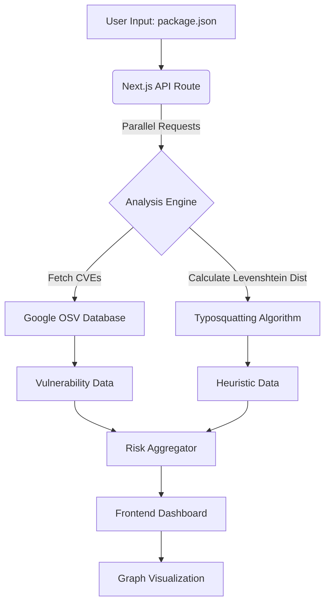

# Dependency Risk Visualizer (R&D PoC)

## 📌 Project Overview

**Dependency Risk Visualizer** is a Research & Development (R&D) Proof-of-Concept tool designed to analyze **Software Supply Chain Security** risks within the NPM ecosystem.

Unlike standard compliance tools that only check for known vulnerabilities (CVEs), this project combines **OSINT data** with **heuristic analysis** to detect potential attacks, such as Typosquatting, and visualizes dependency relationships using an interactive graph.

### 🎯 Key Capabilities
* **Real-time Vulnerability Intelligence:** Integrated with [Google OSV (Open Source Vulnerabilities)](https://osv.dev/) API to fetch live CVE data.
* **Heuristic Typosquatting Detection:** Implements the **Levenshtein Distance Algorithm** to identify malicious packages trying to mimic popular libraries (e.g., `reac` vs `react`).
* **Interactive Attack Vector Graph:** Visualizes the project's dependency tree using `React Flow` to highlight risky nodes.
* **Risk Scoring Engine:** Aggregates data to categorize packages as `SAFE`, `SUSPICIOUS` (Heuristics), or `VULNERABLE` (Known CVE).

---

## 🏗️ Technical Architecture

The project is built on the **Next.js App Router** architecture, ensuring a strict separation between the server-side analysis logic and the client-side presentation layer.

### Core Concepts
1.  **Algorithmic Analysis:** Uses fuzzy string matching to detect anomalies in package naming conventions.
2.  **Concurrency:** Utilizes `Promise.all` for parallel processing of dependency checks to optimize performance for large `package.json` files.
3.  **Defensive Engineering:** Strict TypeScript typing, input validation, and fail-safe API error handling.

### Data Flow

## Getting Started
### Prerequisites
* Node.js 18+
* npm or yarn

### Installation

# 1. Clone the repository
git clone [https://github.com/JohnyProduction/dependency-risk-visualizer.git](https://github.com/JohnyProduction/dependency-risk-visualizer.git)

# 2. Navigate to the project directory
cd dependency-risk-visualizer

# 3. Install dependencies
npm install

# 4. Run the development server
npm run dev

Open http://localhost:3000 with your browser to see the result.

## Usage & Demo Scenario
1. Navigate to the Dashboard.
2. Click the "Load Demo" button (or paste your own package.json).
3. Observe the analysis results:

*  Red (VULNERABLE): Package has known CVEs (sourced from OSV).

* Amber (SUSPICIOUS): Package name is deceptively similar to a popular library (Typosquatting detection).

* Green (SAFE): No known threats detected.

### Detection Example (Typosquatting)
If the input file contains:
"reac": "18.2.0"

The system will flag this as SUSPICIOUS with the warning:
"Potential Typosquatting detected. The name is dangerously similar to: 'react'."

## Future Roadmap
* [ ] Dependency Confusion: Implementation of private registry checks.

* [ ] Transitive Analysis: Deep scanning of nested dependencies.

* [ ] Rust Integration: Rewriting the core analysis engine in Rust (via WASM) for high-performance scanning.